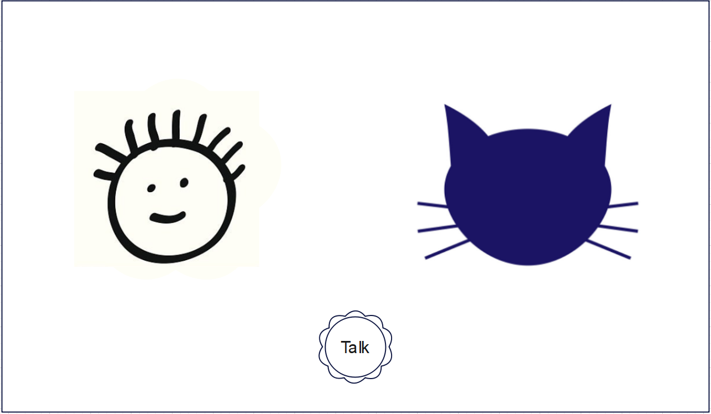

# bluecat

This is a bluecat project that provides a cute user interface 
for children to talk to the latest technology AI robot.
It can understand input in multiple languages and respond 
according to the input language. This helps improve children's
communication skills and satisfy their curiosity. It can also
respond intelligently based on the child's expressions and 
surrounding environment captured by the camera. 
The main function:

- Multilingual Oral Communication
- Camera Function (Future)
- Animated BlueCat Feature (Future)

